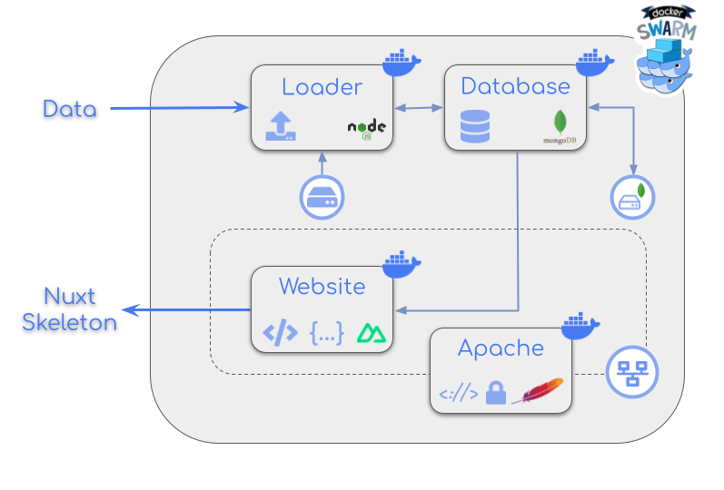

# Docker web services

In this **proof of concept** there are all the files needed for executing the different services for executing a website: **apache**, **front-end**, **back-end**, **database** and **data loader**. All these services have been integrated into docker containers and connected between them via docker networks.

This help contains the instructions for **launching the services** via **Docker Swarm**. If you want to launch them via **Dockerfiles**, please [**click here**](via_docker.md). If you want to launch them via **docker-compose**, please [**click here**](via_docker_compose.md).

Schema of web **services**. Each box in the schema is a **service** encapsulated into a docker **container**. See the following figure:

<div align="center" style="display:flex;align-items:center;justify-content:space-around;">

</div>

## Services description

### Apache

The Apache HTTP Server, colloquially called Apache, is a **Web server** application notable for playing a key role in the initial growth of the World Wide Web:

https://hub.docker.com/_/httpd

### Website

Both the front-end and the back-end of the website are integrated in the **same service** using Nuxt 3.

For this proof of concept, the following repo is used:

https://mmb.irbbarcelona.org/gitlab/gbayarri/nuxt-skeleton.git

### Data loader

The data loader is a node **JS script** made for load, list and remove data from a mongodb database.

For this proof of concept, the following repo is used:

https://mmb.irbbarcelona.org/gitlab/gbayarri/loader-base.git

### Database

The database used is **mongodb** inside a docker container:

https://github.com/docker-library/mongo

For this proof of concept, the choosen version of mongo is 6.

## Prepare configuration files

### docker-compose.yml

The [**docker-compose.yml**](./docker-compose.yml) is the file that specifies what **images** are required, what **ports** they need to expose, whether they have access to the host **filesystem**, what **commands** should be run when they start up, and so on.

```yaml
services:
  apache:
    image: apache_image   # name of apache image
    build:
      context: ./apache   # folder to search Dockerfile for this image
      args:
        WEBSITE_INNER_PORT: ${WEBSITE_INNER_PORT} 
    ports:
      - "${APACHE_HTTP_OUTER_PORT}:${APACHE_HTTP_INNER_PORT}"
      - "${APACHE_HTTPS_OUTER_PORT}:${APACHE_HTTPS_INNER_PORT}"
    networks:
      - webnet
    deploy:
      replicas: ${APACHE_REPLICAS}  # Ensure this service is not deployed by default as it is a one-time task
      resources:
        limits:
          cpus: ${APACHE_CPU_LIMIT}   # Specify the limit number of CPUs
          memory: ${APACHE_MEMORY_LIMIT}   # Specify the limit memory
        reservations:
          cpus: ${APACHE_CPU_RESERVATION}   # Specify the reserved number of CPUs
          memory: ${APACHE_MEMORY_RESERVATION}   # Specify the reserved memory
      restart_policy:
        condition: any   # Restart always

  loader:
    image: loader_image   # name of loader image
    build:
      context: ./loader   # folder to search Dockerfile for this image
      args:
        DB_HOST: ${DB_HOST} 
        DB_PORT: ${DB_OUTER_PORT}
        DB_DATABASE: ${DB_DATABASE} 
        DB_AUTHSOURCE: ${DB_AUTHSOURCE} 
        LOADER_DB_LOGIN: ${LOADER_DB_LOGIN}
        LOADER_DB_PASSWORD: ${LOADER_DB_PASSWORD} 
    volumes:
      - loader_volume:/data   # path from where the data will be taken
    networks:
      - dbnet
    deploy:
      replicas: ${LOADER_REPLICAS}  # Ensure this service is not deployed by default as it is a one-time task
      resources:
        limits:
          cpus: ${LOADER_CPU_LIMIT}   # Specify the limit number of CPUs
          memory: ${LOADER_MEMORY_LIMIT}   # Specify the limit memory
        reservations:
          cpus: ${LOADER_CPU_RESERVATION}   # Specify the reserved number of CPUs
          memory: ${LOADER_MEMORY_RESERVATION}   # Specify the reserved memory

  website:
    image: website_image   # name of website image
    build:
      context: ./website  # folder to search Dockerfile for this image
      args:
        DB_HOST: ${DB_HOST}
        DB_PORT: ${DB_OUTER_PORT}
        DB_DATABASE: ${DB_DATABASE}
        DB_AUTHSOURCE: ${DB_AUTHSOURCE}
        WEBSITE_INNER_PORT: ${WEBSITE_INNER_PORT}
        WEBSITE_DB_LOGIN: ${WEBSITE_DB_LOGIN}
        WEBSITE_DB_PASSWORD: ${WEBSITE_DB_PASSWORD}
        WEBSITE_BASE_URL_DEVELOPMENT: ${WEBSITE_BASE_URL_DEVELOPMENT}
        WEBSITE_BASE_URL_STAGING: ${WEBSITE_BASE_URL_STAGING}
        WEBSITE_BASE_URL_PRODUCTION: ${WEBSITE_BASE_URL_PRODUCTION}
        WEBSITE_CUSTOM: ${WEBSITE_CUSTOM}
    depends_on:
      - mongodb
    ports:
      - "${WEBSITE_PORT}:${WEBSITE_INNER_PORT}"   # port mapping, be aware that the second port is the same exposed in the website/Dockerfile
    networks:
      - dbnet
      - webnet
    deploy:
      replicas: ${WEBSITE_REPLICAS}   # Specify the number of replicas for Docker Swarm
      resources:
        limits:
          cpus: ${WEBSITE_CPU_LIMIT}   # Specify the limit number of CPUs
          memory: ${WEBSITE_MEMORY_LIMIT}   # Specify the limit memory
        reservations:
          cpus: ${WEBSITE_CPU_RESERVATION}   # Specify the reserved number of CPUs
          memory: ${WEBSITE_MEMORY_RESERVATION}   # Specify the reserved memory
      restart_policy:
        condition: any   # Restart always
      update_config:
        order: start-first  # Priority over other services

  mongodb:
    image: mongo:6
    environment:
      MONGO_INITDB_ROOT_USERNAME: ${MONGO_INITDB_ROOT_USERNAME}
      MONGO_INITDB_ROOT_PASSWORD: ${MONGO_INITDB_ROOT_PASSWORD}
    ports:
      - "${DB_OUTER_PORT}:${DB_INNER_PORT}"
    volumes:
      - ${DB_VOLUME_PATH}:/data/db   # path where the database will be stored (outside the container, in the host machine)
      - ./mongo-init.js:/docker-entrypoint-initdb.d/mongo-init.js:ro   # path to the initialization script
    networks:
      - dbnet
    deploy:
      replicas: ${DB_REPLICAS}   # Specify the number of replicas for Docker Swarm
      resources:
        limits:
          cpus: ${DB_CPU_LIMIT}    # Specify the limit number of CPUs
          memory: ${DB_MEMORY_LIMIT}   # Specify the limit memory
        reservations:
          cpus: ${DB_CPU_RESERVATION}   # Specify the reserved number of CPUs
          memory: ${DB_MEMORY_RESERVATION}   # Specify the reserved memory
      restart_policy:
        condition: on-failure   # Restart only on failure

volumes:
  loader_volume:
    driver: local
    driver_opts:
      type: none
      o: bind
      device: ${LOADER_VOLUME_PATH}   # bind the volume to LOADER_VOLUME_PATH on the host

networks:
  dbnet: 
    external: true   # Use an external network
  webnet:
    name: webnet   # Name of the network
    driver: overlay   # Use an overlay network
```

All the variables are defined in a `.env` file. See following section.

### .env file

⚠️ No sensible default value is provided for any of these fields, they **need to be defined** ⚠️

An `.env` file must be created in the **root** folder. The file [`.env.git`](.env.git) can be taken as an example. The file must contain the following environment variables:

| key              | value   | description                                     |
| ---------------- | ------- | ----------------------------------------------- |
| DOCKER_DEFAULT_PLATFORM         | string  | default platform (architecture and operating system), ie linux/amd64                               |
| &nbsp;
| APACHE_HTTP_OUTER_PORT         | number  | apache outer port for http protocol                                        |
| APACHE_HTTPS_OUTER_PORT         | number  | apache outer port for https protocol                                        |
| APACHE_HTTP_INNER_PORT         | number  | apache inner port for http protocol                                        |
| APACHE_HTTPS_INNER_PORT         | number  | apache inner port for https protocol                                        |
| APACHE_REPLICAS         | number  | apache number of replicas to deploy                                        |
| APACHE_CPU_LIMIT         | string  | apache limit number of CPUs                                        |
| APACHE_MEMORY_LIMIT         | string  | apache limit memory                                        |
| APACHE_CPU_RESERVATION         | string  | apache reserved number of CPUs                                        |
| APACHE_MEMORY_RESERVATION         | string  | apache reserved memory                                        |
| &nbsp;
| LOADER_VOLUME_PATH         | string  | path where the loader will look for files                                        |
| LOADER_REPLICAS         | number  | loader number of replicas to deploy                                        |
| LOADER_CPU_LIMIT      | string  | loader limit number of CPUs                                    |
| LOADER_MEMORY_LIMIT          | string | loader limit memory                           |
| LOADER_CPU_RESERVATION          | string  | loader reserved number of CPUs                           |
| LOADER_MEMORY_RESERVATION      | string  | loader reserved memory                         |
| LOADER_DB_LOGIN      | string  | db user for loader                         |
| LOADER_DB_PASSWORD      | string  | db password for loader                       |
| &nbsp;
| WEBSITE_PORT         | number  | website outer port                                        |
| WEBSITE_REPLICAS         | number  | website number of replicas to deploy                                        |
| WEBSITE_CPU_LIMIT    | string  | website limit number of CPUs                               |
| WEBSITE_MEMORY_LIMIT    | string  | website limit memory                             |
| WEBSITE_CPU_RESERVATION    | string  | website reserved number of CPUs                               |
| WEBSITE_MEMORY_RESERVATION    | string  | website reserved memory                               |
| WEBSITE_INNER_PORT         | number  | website inner port                                        |
| WEBSITE_DB_LOGIN    | string  | db user for website REST API                               |
| WEBSITE_DB_PASSWORD    | string  | db password for website REST API                               |
| WEBSITE_BASE_URL_DEVELOPMENT    | string  | baseURL for development                               |
| WEBSITE_BASE_URL_STAGING    | string  | baseURL for staging                               |
| WEBSITE_BASE_URL_PRODUCTION    | string  | baseURL for production                               |
| WEBSITE_CUSTOM    | string  | whether or not custom images and styles provided                               |
| &nbsp;
| DB_VOLUME_PATH         | string  | path where the DB will look for files                                        |
| DB_OUTER_PORT         | number  | DB outer port                                        |
| DB_INNER_PORT         | number  | DB inner port                                        |
| DB_REPLICAS         | number  | DB number of replicas to deploy                                        |
| DB_CPU_LIMIT      | string  | DB limit number of CPUs                                    |
| DB_MEMORY_LIMIT          | string | DB limit memory                           |
| DB_CPU_RESERVATION          | string  | DB reserved number of CPUs                           |
| DB_MEMORY_RESERVATION      | string  | DB reserved memory                         |
| DB_HOST      | `<url>`  | url of the db server                          |
| DB_DATABASE      | string  | name of the  DB collection                          |
| DB_AUTHSOURCE      | string  | the DB collection the user will attempt to authenticate to                           |
| &nbsp;
| MONGO_INITDB_ROOT_USERNAME      | string  | root user for the DB                         |
| MONGO_INITDB_ROOT_PASSWORD      | string  | root password for the DB                       |

**Important:** the formats of **cpus** and **memory** must be in string format between single quotes. Example:

```
LOADER_VOLUME_PATH=/path/to/loader  # path to volume
LOADER_CPU_LIMIT='4.00'  # cpus in float format
LOADER_MEMORY_LIMIT='2G'  # memory indicating unit (G, M)
```

The **DB_HOST** must be the name of the **stack service** followed by **underscore** and the **name of the service** as defined in the [**docker-compose.yml**](./docker-compose.yml) file (ie _my_stack_mongodb_).

The **DB_DATABASE** and **DB_AUTHSOURCE** must be the same used in the **mongo-init.js** file.

The credentials **LOADER_DB_LOGIN** and **LOADER_DB_PASSWORD** must be the same defined in the **mongo-init.js** file with the **readWrite** role.

The credentials **WEBSITE_DB_LOGIN** and **WEBSITE_DB_PASSWORD** must be the same defined in the **mongo-init.js** file with the **read** role.

If `WEBSITE_CUSTOM=true`, make sure to provide a **/config folder** in the [**website**](website) folder with a **custom.css**, **favicon.ico** and **logo.png** files.

Neither the **WEBSITE_BASE_URL_DEVELOPMENT** nor the **WEBSITE_BASE_URL_STAGING** shouldn't be used when running as a docker service. 

⚠️ The [**website/Dockerfile**](website/Dockerfile) is configured for running the website in **production** mode. This means that it will take **WEBSITE_BASE_URL_PRODUCTION** as **baseURL**. For changing this, please edit the [**website/Dockerfile**](website/Dockerfile) line: `RUN npm run build:production` ⚠️

## Build services

First off, go to the root of the project. Then, init **Docker Swarm**:

```sh
docker swarm init
```

**Note:** when a system has **multiple network** interfaces with **different IP** addresses, Docker Swarm requires you to explicitly **specify which IP** address it should use for advertising:

```sh
docker swarm init --advertise-addr <IP_ADDRESS>
```

In order to execute the **long-term** tasks in **Docker Swarm** and the **one-off tasks**, such as the **loader** in this proof of concept, in **Docker Compose**, the **networks** are declared as **external** in the **docker-compose.yml** file, so they must be created before the `docker-compose build` and the `docker stack deploy`:

```sh
docker network create --driver overlay --attachable dbnet
docker network create --driver overlay --attachable webnet
```

> NOTE: **From July 2024 onwards**, the instruction for Docker Compose in **mac** is without hyphen, so from now on, `docker-compose build` is `docker compose build` when executing in **macOS**.

For building the services via **Docker Compose**, please execute the following instruction:

```sh
docker-compose build
```

Export environment variables defined in [**root .env file**](#root) and deploy docker stack:

```sh
export $(grep -v '^#' .env | xargs)
docker stack deploy -c docker-compose.yml my_stack
```

Check services:

```sh
$ docker stack services my_stack
ID             NAME               MODE         REPLICAS   IMAGE                  PORTS
<ID>           my_stack_apache    replicated   1/1        apache_image:latest    *:80->80/tcp, *:443->443/tcp
<ID>           my_stack_loader    replicated   0/0        loader_image:latest    
<ID>           my_stack_mongodb   replicated   1/1        mongo:6                *:27017->27017/tcp
<ID>           my_stack_website   replicated   2/2        website_image:latest   *:8080->3001/tcp
```

Check nodes:

```sh
docker node ls
```

## Execute services

### Use loader

While the **mongodb** and **website** containers will remain up, the loader must be called every time is needed. As it is a **one-off task**, **Docker Compose** is used for running it.

**List** database documents:

```sh
docker-compose run --rm loader list
```
**Load** documents to database:

As the database comes empty, it's necessary to load some data for running the website properly. The route for the upload.json must be the same defined as **working_dir** in the **docker-compose.yml** file (ie /data). And the upload.json file must be in the **LOADER_VOLUME_PATH** path defined in the [**root .env**](#env-file) file.

```sh
docker-compose run --rm loader load /data/upload.json
```

For this proof of concept, the upload.json must have the following format:

```json
[
  {
    "title": "Document title",
    "description": "Document description",
    "longDescription": "Document long description, lorem ipsum dolor sit amet, consectetur adipiscing elit",
    "authors": [
      {
        "name": "Author 1 name",
        "email": "email1@mail.com"
      },
      {
        "name": "Author 2 name",
        "email": "email2@mail.com"
      }
    ],
    "files": [
      {
        "title": "file1",
        "path": "/data/file1"
      },
      {
        "title": "file1",
        "path": "/data/file1"
      },
    ]
  }
]
```

Note that, in this proof of concept, the front-end shows the files in a 3D structure visualizer, so the files should be in **PDB** format. The route for these files must be the same defined as **working_dir** in the **docker-compose.yml** file (ie /data). And the files must be in the **volumes** path defined in the **docker-compose.yml** file.

**Remove** database document:

```sh
docker-compose run --rm loader remove -d <ID>
```

### Check website

Open a browser and type:

```
http://localhost
```

## Stop services

Remove stack:

```sh
docker stack rm my_stack
```

Leave swarm:

```sh
docker swarm leave --force
```

## Tips

### Clean docker

When working with Docker, **even after removing images and containers**, Docker can leave behind various unused resources that take up **disk space**. To clean up your system effectively, you can use the following commands:

1. **Remove** unused containers, images and networks:

    Docker has a built-in command to clean up resources that are not in use:

        docker system prune

    This command will prompt you to confirm that you want to remove all unused data. If you want to avoid the prompt, you can add the -f (force) flag:

        docker system prune -f

2. **Cleaning up** the Docker builder **cache**:

    Docker build cache can also take up significant space. You can remove unused build cache:

        docker builder prune

    If you want to remove all build cache, including the cache used by the active build process:

        docker builder prune -a -f

3. Remove unused **volumes**:

    By default, docker system prune does not remove unused volumes. If you want to remove them as well, you can use:

        docker system prune --volumes

    If you want to avoid the prompt, you can add the -f (force) flag:

        docker system prune --volumes -f

4. **Check disk usage** by Docker objects

        docker system df


### Execute mongo docker in terminal mode

```sh
docker exec -it <mongo_container_ID> bash
```

And then: 

```sh
mongosh 
```

For entering the database in **terminal mode**. Take into account that, for **checking** your database and its **collections**, you must use the **authentication credentials** defined in the [**mongo-init.js**](./mongo-init.js) file. For example, for checking the **collections** of the my_db **database**, please follow the next steps:

Switch to **my_db** database (or the name defined in the [**mongo-init.js**](./mongo-init.js) file):

    use my_db

**Authenticate** with one of the **users** defined in the [**mongo-init.js**](./mongo-init.js) file:

    db.auth('user_r','pwd_r');

Execute some mongo shell instruction:

    show collections

Additionally, users are able to access the database as a **root/admin** user, as defined in the [**docker-compose.yml**](./docker-compose.yml) file:

    mongosh --username <ROOT_USER> --password <ROOT_PASSWORD>

Take into account that acessing mongoDB as **root/admin** user is **not recommended** as with this user there are **no restrictions** once inside the database. We strongly recommend to use the **users** defined in the [**mongo-init.js**](./mongo-init.js) file for accessing the database.

### Apache logs

    docker logs <apache_container_ID>

### Check containers

Check that the **mongo** and the replicas of **web containers** are up & running:

```sh
$ docker ps -a
CONTAINER ID   IMAGE                  COMMAND                  CREATED         STATUS         PORTS             NAMES
<ID>           apache_image:latest    "httpd-foreground"       4 minutes ago   Up 4 minutes   80/tcp, 443/tcp   my_stack_apache.1.<ID>
<ID>           mongo:6                "docker-entrypoint.s…"   4 minutes ago   Up 4 minutes   27017/tcp         my_stack_mongodb.1.<ID>
<ID>           website_image:latest   "pm2-runtime start e…"   4 minutes ago   Up 4 minutes                     my_stack_website.1.<ID>
<ID>           website_image:latest   "pm2-runtime start e…"   4 minutes ago   Up 4 minutes                     my_stack_website.2.<ID>
```

### Inspect docker network 

```sh
docker network inspect dbnet
```

should show something like:

```json
[
    {
        "Name": "dbnet",
        "Id": "<ID>",
        "Created": "<DATE>",
        "Scope": "swarm",
        "Driver": "overlay",
        "EnableIPv6": false,
        "IPAM": {
            "Driver": "default",
            "Options": null,
            "Config": [
                {
                    "Subnet": "<IP>",
                    "Gateway": "<IP>"
                }
            ]
        },
        "Internal": false,
        "Attachable": true,
        "Ingress": false,
        "ConfigFrom": {
            "Network": ""
        },
        "ConfigOnly": false,
        "Containers": {
            "<ID>": {
                "Name": "my_stack_website.2.<ID>",
                "EndpointID": "<ID>",
                "MacAddress": "<MAC>",
                "IPv4Address": "<IP>",
                "IPv6Address": ""
            },
            "<ID>": {
                "Name": "my_stack_website.1.<ID>",
                "EndpointID": "<ID>",
                "MacAddress": "<MAC>",
                "IPv4Address": "<IP>",
                "IPv6Address": ""
            },
            "<ID>": {
                "Name": "my_stack_mongodb.1.<ID>",
                "EndpointID": "<ID>",
                "MacAddress": "<MAC>",
                "IPv4Address": "<IP>",
                "IPv6Address": ""
            },
            "lb-dbnet": {
                "Name": "dbnet-endpoint",
                "EndpointID": "<ID>",
                "MacAddress": "<MAC>",
                "IPv4Address": "<IP>",
                "IPv6Address": ""
            }
        },
        "Options": {
            "com.docker.network.driver.overlay.vxlanid_list": "<ID>"
        },
        "Labels": {},
        "Peers": [
            {
                "Name": "<ID>",
                "IP": "<IP>"
            }
        ]
    }
]
```

### Scale a service:

Add two more replicas to my_stack_website:

```sh
docker service scale my_stack_website=4
```

### Check service tasks

```sh
docker service ps my_stack_mongodb
```

### Docker stats

Check resources consumption for all running containers:

```sh
$ docker stats
CONTAINER ID   NAME                                           CPU %     MEM USAGE / LIMIT   MEM %     NET I/O           BLOCK I/O         PIDS
<ID>           my_stack_apache.1.<ID>                         0.01%     13.35MiB / 1GiB     1.30%     13.1kB / 12.7kB   6.73MB / 4.1kB    109
<ID>           my_stack_mongodb.1.<ID>                        0.44%     105.2MiB / 2GiB     1.28%     43.1MB / 247MB    0B / 499MB        50
<ID>           my_stack_website.1.<ID>                        0.26%     73.03MiB / 2GiB     0.71%     59.3MB / 29.9MB   0B / 24.6kB       22
<ID>           my_stack_website.2.<ID>                        0.33%     70.78MiB / 2GiB     0.69%     60.4MB / 29.5MB   0B / 24.6kB       22
```

### Docker logs

Show logs for a service:

```sh
docker service logs my_stack_mongodb
```

## Credits

Genís Bayarri, Adam Hospital.

## Copyright & licensing

This website has been developed by the [MMB group](https://mmb.irbbarcelona.org) at the [IRB Barcelona](https://irbbarcelona.org).

© 2024 **Institute for Research in Biomedicine**

Licensed under the **Apache License 2.0**.